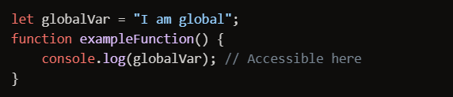
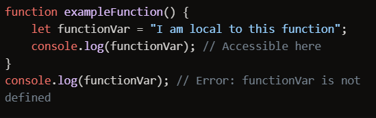
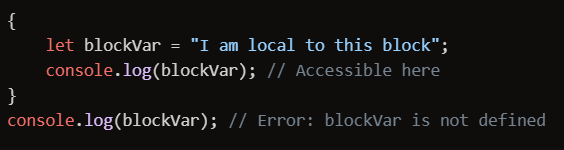
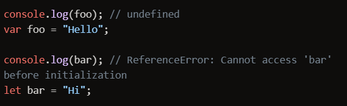
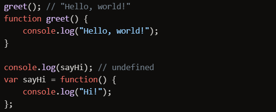
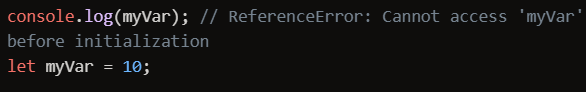

---

# What is Scope ?
## In JavaScript, scope refers to the context in which variables, functions, and objects are accessible. Understanding scope is crucial for writing efficient and bug-free code. There are three main types of scope in JavaScript:

1. Global Scope: Variables declared 

---

2. Function Scope: Variables declared within a function are in the function scope. They can only be accessed within that function.

---

3.Block Scope: Introduced with ES6, variables declared with let or const within a block (e.g., inside {}) are in the block scope. They can only be accessed within that block.

---

# What is Hoisting in JS ?
## Hoisting in JavaScript is a behavior where variable and function declarations are moved to the top of their containing scope during the compilation phase. This means you can use variables and functions before you declare them in your code. However, only the declarations are hoisted, not the initializations.

1. Variable Hoisting:
    * Variables declared with var are hoisted to the top of their function or global scope and initialized with undefined.
    * Variables declared with let and const are also hoisted to the top of their block scope, but they are not initialized. Accessing them before their declaration results in a ReferenceError.

2. Function Hoisting:
    * Function declarations are hoisted to the top of their scope, so you can call a function before you declare it.
    * Function expressions (including those using var, let, or const) are not hoisted in the same way. Only the variable declaration is hoisted, not the function assignment.

--- 

# What is TDZ ?
## In JavaScript, TDZ stands for Temporal Dead Zone. This concept is related to the behavior of variables declared with let and const. Here’s a brief explanation:

* Temporal Dead Zone (TDZ): This is the period during which a variable is in scope but not yet declared. If you try to access the variable before its declaration, JavaScript will throw a ReferenceError.

### In the code above, myVar is in the TDZ from the start of the block until the let declaration is encountered. Attempting to access myVar before its declaration results in an error.
--- 

